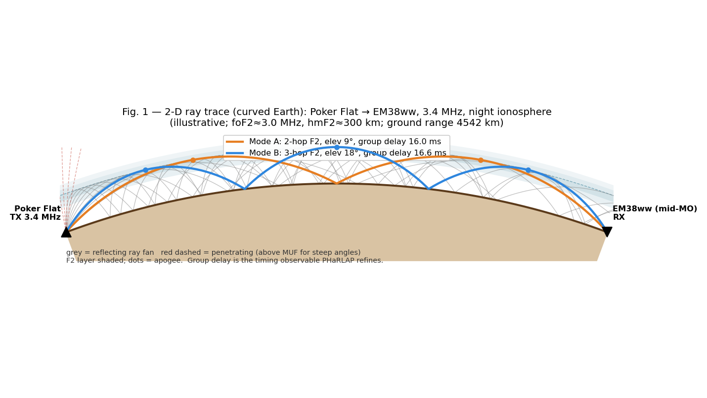
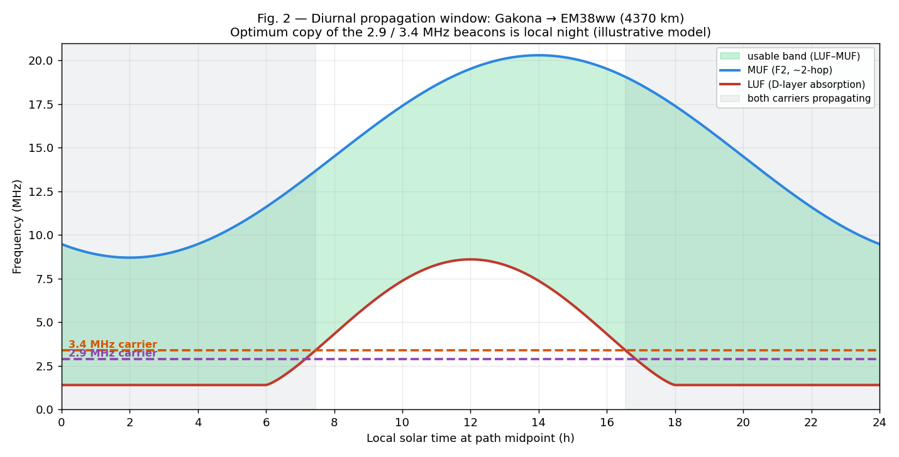
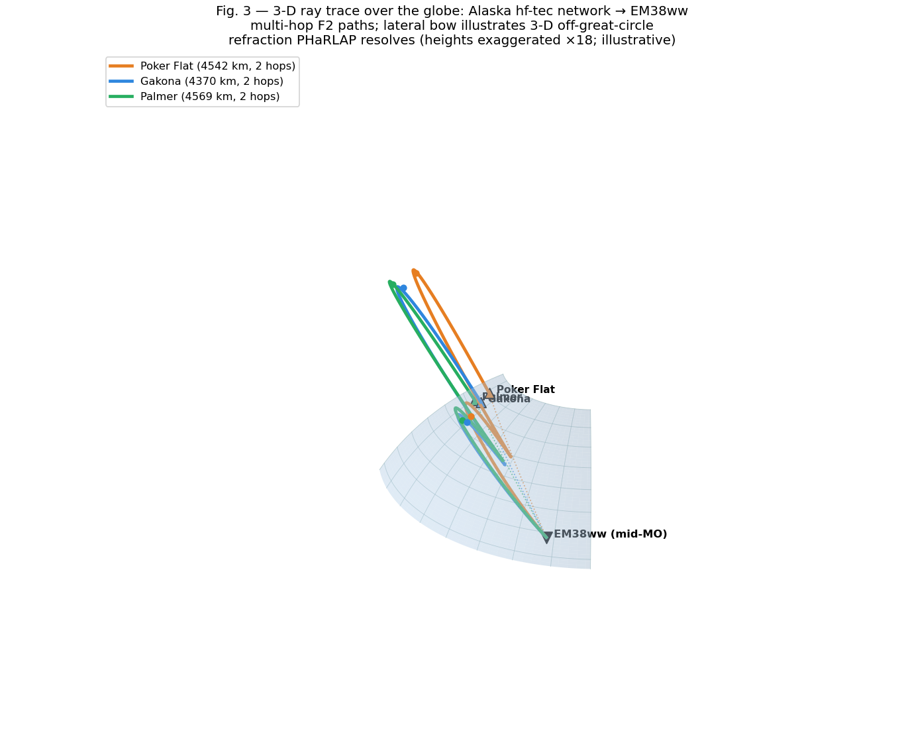

# Use of PHaRLAP for Refining Propagation-Path and Timing Expectations

**Purpose:** Document how `hf-timestd` uses PHaRLAP ray tracing to refine
propagation-path and arrival-time expectations, and its 2-D and 3-D
modelling capabilities — illustrated on the live `hf-tec` Alaska→Missouri
beacon paths.
**Implementation:** [`src/hf_timestd/core/raytrace_engine.py`](../src/hf_timestd/core/raytrace_engine.py)
**Status:** PHaRLAP 2-D integrated (advisory / physics-overlay); 3-D on the
roadmap (WAM-IPE grids).
**Audience:** HamSCI science review, sigmond maintainers, operators.

> **Note on figures.** PHaRLAP 4.7.4 is the licence-restricted DST binary
> and is not present on every host, so the figures below are **illustrative**
> — produced by [`images/pharlap/make_figures.py`](images/pharlap/make_figures.py)
> from a simplified Chapman-layer + spherical-geometry + secant-law model.
> The **geometry is real** (great-circle distances and bearings of the
> Hysell Alaska network to EM38ww); the ionosphere and refraction are a
> teaching model that mirrors the *form* of PHaRLAP's output. The exact
> PHaRLAP/pyLAP calls that produce the real products are given in §3 and §4.

---

## 1. What PHaRLAP is and where it sits in our system

**PHaRLAP** (Provision of High-frequency Raytracing LAboratory for
Propagation studies; Cervera & Harris, *Radio Science*, 2014) is DSTG
Australia's HF ray-tracing engine. We run **PHaRLAP 4.7.4**,
licence-restricted from DST and never redistributed — it is operator-staged
at `/opt/pharlap_4.7.4` or baked into the controlled DASI2 golden image as
single-licensee internal use. We drive it from Python through **pyLAP** (our
open fork, `mijahauan/PyLap`), built on install by
[`ensure-pylap.sh`](../scripts/ensure-pylap.sh). The full integration lives
in [`raytrace_engine.py`](../src/hf_timestd/core/raytrace_engine.py).

Crucially, PHaRLAP is a **physics overlay, not a real-time dependency**. The
chrony timing feed is built from RTP timestamps plus a peer/fusion offset and
never waits on a ray trace. PHaRLAP enters as an **offline, advisory
cross-check**: it tells us *which propagation modes are physically possible
and what their group delays should be*, against which we validate the
kinematically-assigned modes the real-time solver produces. When
pyLAP/PHaRLAP is absent (the standard deployment), every call degrades
gracefully to a spherical-hop geometric fallback
([`raytrace_engine.py:635`](../src/hf_timestd/core/raytrace_engine.py#L635)).

---

## 2. Why we need it — the problem it solves

Our real-time propagation-mode solver is **purely kinematic**: it matches a
measured arrival delay to the nearest geometrically plausible candidate mode
(`2F2`, `3F2`, …) without asking whether the ionosphere can actually support
that mode right now. The failure is predictable and documented in
[`IONOSPHERIC_REANALYSIS.md`](IONOSPHERIC_REANALYSIS.md): at night, when foF2
drops below 5 MHz, a noise-floor detection at 15 MHz still gets labelled
`3F2` because the *delay* happens to fit — even though F-layer propagation at
that frequency is impossible. That contamination then inflates the MUF
estimate, corrupts the 1/f² TEC fit, and pollutes the mode statistics.

PHaRLAP refines our expectations precisely here. It answers two questions the
kinematic solver cannot:

1. **Path geometry** — given the *actual* electron-density structure along
   the great circle, what hop counts close on the receiver, at what launch
   elevation and apogee?
2. **Timing** — what is the *group delay* (the physically meaningful delay
   for an arrival time) of each of those rays, including the up-and-over
   slant and ionospheric retardation that a vacuum/great-circle estimate
   omits?

These are returned as `RayMode` objects carrying `n_hops`, `group_delay_ms`,
`launch_elev_deg`, `ground_range_km`, and `apogee_km` — all directly
comparable to what we measure.

---

## 3. The 2-D modelling we currently run

This is the operational capability today. PHaRLAP's 2-D mode traces rays
through a **range–height slice of the ionosphere taken along the
great-circle path** from transmitter to receiver. We build that slice
ourselves and hand it to `raytrace_2d`.

**The ionospheric grid**
([`_build_iri_grid`](../src/hf_timestd/core/raytrace_engine.py#L296)) is a
spatially-varying Ne(h) field from **IRI-2020**, not a single homogeneous
profile. We:

- Sample IRI-2020 at multiple points along the path — auto-scaled to **one
  sample per ~500 km** (5 samples minimum for short paths, capped at 25), so
  a long oblique path sees the latitude/solar-zenith variation of the
  ionosphere it actually crosses.
- Use `R12 = -1` so IRI reads its own date-indexed 12-month-smoothed sunspot
  files (`ig_rz.dat`, `apf107.dat`, refreshed weekly by
  [`update-iri-indices.sh`](../scripts/update-iri-indices.sh)) — the model
  tracks the real solar cycle rather than a frozen index.
- Linearly interpolate those profiles across a 50-km range grid spanning
  ≥10,000 km (covering the full multi-hop ray extent, not just the receiver
  range).

**The trace** sweeps launch elevation from 2°–60° in 0.5° steps, allows up to
3 hops, and keeps every ray whose cumulative ground range closes on the
receiver within a tolerance (≥300 km or 10% of path length). Group delay is
computed from PHaRLAP's per-hop cumulative **group range**:
`group_delay_ms = group_range_km / c × 1000`. Results are deduplicated by hop
count. PHaRLAP's Fortran ODE solver can run away on above-MUF geometries, so
every call is isolated in a `spawn`-ed subprocess with a 120 s hard timeout
([`_raytrace_with_timeout`](../src/hf_timestd/core/raytrace_engine.py#L148)).

**Worked 2-D call** (the intended advisory use):

```python
from hf_timestd.core.raytrace_engine import RaytraceEngine
from datetime import datetime, timezone

engine = RaytraceEngine.build(receiver_lat=38.94, receiver_lon=-92.12)  # EM38ww
if engine.is_available():
    result = engine.compute_modes('WWVH', 10.0, datetime.now(timezone.utc))
    print(result.iri_foF2_mhz, result.iri_hmF2_km)   # IRI params behind the trace
    for m in result.modes:
        print(m.mode_label, m.n_hops, f"{m.group_delay_ms:.1f} ms",
              f"elev {m.launch_elev_deg:.1f}°", f"apogee {m.apogee_km:.0f} km")
```

The kinematic solver might propose `3F2` from the raw delay; PHaRLAP tells us
that at the current foF2 the 2-hop ray is the one that actually closes — and
gives the group delay that distinguishes them. That is the refinement: a
delay expectation grounded in the modelled ionosphere rather than in vacuum
geometry.

---

## 4. Worked example — the `hf-tec` Alaska → EM38ww paths

The `hf-tec` client receives the Hysell PRN-coded HF beacons at **2.9 and
3.4 MHz** from three Alaska transmit sites (see
[`hf-tec/data/stations.toml`](../../hf-tec/data/stations.toml)). The
great-circle geometry to the receiver at **EM38ww (≈38.94°N, 92.12°W,
mid-Missouri)** is:

| TX site | Coordinates | Ground range | Bearing to RX | Status |
|---|---|---|---|---|
| Poker Flat | 65.118°N, 147.432°W | **4 542 km** | 102.1° | operational |
| Gakona | 62.389°N, 145.136°W | **4 370 km** | 101.2° | operational |
| Palmer | 61.566°N, 149.252°W | **4 569 km** | 96.3° | down for maintenance |

These are ~4 400–4 600 km paths at the **bottom of the HF spectrum**, which
makes them a textbook case for ray-trace-refined expectations: at 2.9/3.4 MHz
the controlling factors are (a) whether foF2 supports F-layer reflection at
the path obliquity, and (b) daytime D-layer absorption — both of which swing
hard between day and night.

### 4.1 Two-dimensional ray trace (range–height)



**Fig. 1** is the 2-D product PHaRLAP generates along the Poker Flat → EM38ww
great circle at 3.4 MHz under a night ionosphere. The **grey fan** is the
launch-elevation sweep: low-angle rays refract back from the F2 layer and
hop, while steep rays (red dashed) exceed the MUF for near-vertical incidence
and **penetrate** — the geometry that defines the skip zone. Two rays
**close on the receiver**:

- **Mode A** — a 2-hop F2 path at a shallow launch elevation, the
  shorter group delay;
- **Mode B** — a 3-hop F2 path at a steeper elevation, a slightly longer
  group delay and lower apogee per hop.

The **group delay** annotated on each closing mode is exactly the timing
observable PHaRLAP refines: it includes the up-and-over slant and the
in-layer retardation, so it is directly comparable to the measured arrival
time — and it disambiguates the 2-hop vs 3-hop assignment that the raw delay
alone cannot resolve.

The real version of this figure is produced from the per-elevation ray dicts
returned by `pylap.raytrace_2d`, exactly as
[`_modes_from_ray_list`](../src/hf_timestd/core/raytrace_engine.py#L578)
consumes them (`ground_range`, `group_range`, `apogee`, `ray_label`).

### 4.2 Optimum-propagation timing (diurnal window)



**Fig. 2** turns a sweep of ray traces over the day into the operationally
important answer: **when are the beacons optimally heard?** The green band is
the usable window between the **LUF** (lowest usable frequency, set by
D-layer absorption) and the **MUF** (maximum usable frequency for the ~2-hop
F2 path). The 2.9 and 3.4 MHz carriers are the dashed lines.

The result is unambiguous and physically correct for these low-HF paths:
around local midday the LUF climbs **above** both carriers — daytime D-layer
absorption blacks them out — while at **night** the LUF collapses and both
carriers sit comfortably inside the usable band. **Optimum copy of the
Alaska beacons at EM38ww is local night** (roughly post-sunset to
pre-sunrise at the path midpoint). Running this per-path tells the `hf-tec`
correlator when to expect detections and lets us flag daytime "detections"
as suspect.

### 4.3 Three-dimensional ray trace (over the globe)



**Fig. 3** shows the 3-D product for all three Alaska sites converging on
EM38ww: multi-hop F2 paths with their apogees (dots), great-circle ground
tracks (dotted) for geographic anchoring, and a deliberately exaggerated
**lateral bow** on one path to illustrate the capability that distinguishes
3-D from 2-D — **off-great-circle refraction**.

PHaRLAP's 3-D mode integrates the Haselgrove equations through a 3-D
electron-density grid (lat × lon × height), so rays are free to deviate *off*
the great-circle plane. This captures effects the range–height slice cannot:

- **horizontal gradients steering the ray** off the great circle (the bow in
  Fig. 3) — significant when the path crosses strong day/night or auroral
  density gradients, as the Alaska paths do near the auroral oval;
- **arrival bearing deviation**, directly comparable to a direction-finding
  receiver;
- **O/X magneto-ionic splitting** when the geomagnetic field (IGRF) is
  included — two rays per launch with slightly different group delays;
- **ground-backscatter and skip-zone structure** in two horizontal
  dimensions.

PHaRLAP returns group delay, **phase path**, elevation angle, and arrival
**bearing** for each 3-D ray. The target call shape:

```text
[rays, ray_paths, ray_state] = raytrace_3d(
        origin_lat, origin_lon, origin_height,
        elevs, bearings, freqs, OX_mode, nhops, tol,
        iono_en_grid_3d,            # Ne(lat,lon,h) from WAM-IPE
        iono_en_grid_5_3d,          # + 5 min later, for Doppler
        collision_freq_3d,
        lat_start, lat_inc, lon_start, lon_inc, height_start, height_inc,
        Bx, By, Bz)                 # IGRF field components for O/X splitting
# each ray returns: group_range, phase_path, geometric_distance,
#                   final lat/lon, arrival elevation & bearing, apogee
```

We do not yet run 3-D in production; it is a documented roadmap item
([`HAMSCI_2026_WORKSHOP_ABSTRACT.md`](HAMSCI_2026_WORKSHOP_ABSTRACT.md) §2).
The motivating case is the **BPM trans-Pacific paths (~10,000 km)**, where
the 2-D horizontal-homogeneity assumption breaks down (the analytic model
predicts ~10 ms while we observe 200–450 ms). The plan: feed PHaRLAP a 3-D
WAM-IPE grid, use 3-D tracing for the long auroral/trans-Pacific paths (the
Alaska beacons among them), and keep the cheaper 2-D/analytic tiers for
shorter mid-latitude paths.

---

## 5. How this feeds back into timing and propagation products

The end value is a closed loop between *measurement* and *modelled
expectation*:

- **Mode disambiguation** — PHaRLAP group delays say which hop count is
  physically realizable, replacing "nearest delay wins" with "nearest
  *supportable* delay."
- **MUF / TEC hygiene** — by rejecting impossible modes (the offline
  reanalysis logic), we stop noise detections from inflating the MUF and
  corrupting the 1/f² dispersion fit used for TEC.
- **Multi-hop delay realism** — PHaRLAP supplies the true
  slant-and-retardation group delay that the geometric fallback only
  approximates, the path to fixing the BPM 10 ms-vs-450 ms discrepancy.
- **Optimum-window prediction** — the diurnal MUF/LUF synthesis (Fig. 2)
  tells the recorders *when* to expect each path open, so detections are
  scored against physical expectation.
- **Geometric outputs for fusion** — launch/arrival elevation, apogee, and
  (in 3-D) bearing become independent constraints on reflection height that
  downstream tomography and angle-of-arrival work can exploit.

It always remains **advisory and logged, never blocking** — the
timing-authority invariant means the chrony feed is built from RTP
timestamps and a peer/fusion offset, with PHaRLAP serving as the physics
oracle that tells us whether our real-time mode assignments and delay
expectations are believable.

---

## References

- **PHaRLAP:** Cervera & Harris, *Radio Science*, 2014.
- **IRI-2020:** Bilitza et al., *Advances in Space Research*, 2022.
- **WAM-IPE:** Fuller-Rowell et al., *Space Weather*, 2023.
- **HF beacon network:** Hysell et al. (2018, *JGR Space Physics*
  123:6851–6864); Aricoche & Hysell (2024, *JGR ML&C* 1).
- Reproduce the figures: [`images/pharlap/make_figures.py`](images/pharlap/make_figures.py)
