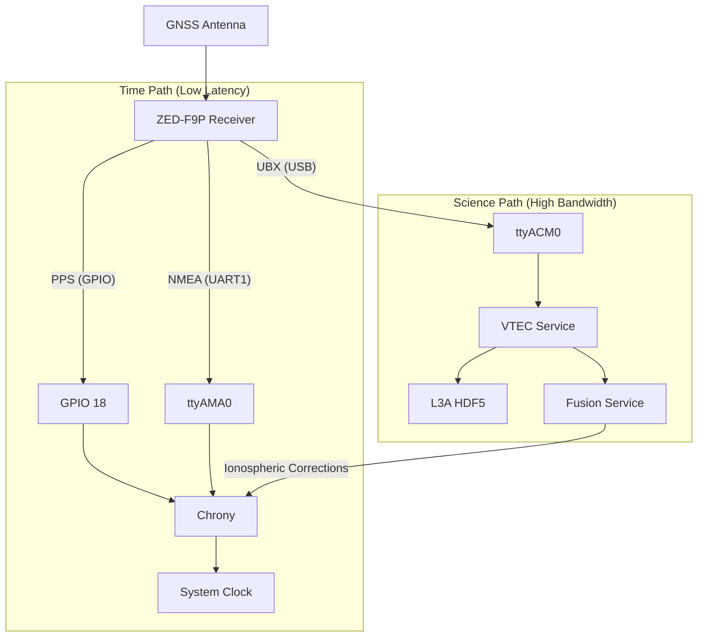

# Time & VTEC Architecture

## Overview

This system utilizes a single **u-blox ZED-F9P** multi-band GNSS receiver to serve two distinct critical functions simultaneously:

1. **Stratum 1 Time Source**: Providing low-latency PPS and NMEA time data to Chrony.
2. **Ionospheric Science Instrument**: Providing high-rate raw observables and ionospheric delay measurements (VTEC) to the scientific pipeline.

This "Split-Path" architecture allows us to maintain nanosecond-level timing precision while gathering valuable geophysical data from the same standard hardware.

## Architecture

The ZED-F9P is configured to output different protocols on different physical interfaces, ensuring that the heavy science data does not introduce latency or jitter into the timing path.

## 1. Time Path (Precision Timing)

**Objective**: Provide stable, low-jitter synchronization for the system clock.

* **Interface**: UART1 (`/dev/ttyAMA0`) + GPIO PPS
* **Protocol**: NMEA 0183 (Standard messages: `$GPRMC`, `$GPZDA`)
* **Rate**: 1 Hz
* **Consumer**: `chrony` (via `refclock SHM` and `PPS`)
* **Configuration**:
  * Baud Rate: 9600 or 115200 (Latency is deterministic)
  * PPS: Rising edge, cable delay compensated.

**Why NMEA?**
While older than binary protocols, NMEA is universally supported by timing daemons like `chronyd` and `ntpd`. By isolating it to the hardware UART, we incur minimal CPU overhead and avoid USB buffering jitter.

## 2. Science Path (Ionospheric VTEC)

**Objective**: Measure Total Electron Content (TEC) for HF propagation analysis.

* **Interface**: USB (`/dev/ttyACM0`)
* **Protocol**: UBX (u-blox Binary)
* **Messages**:
  * `UBX-NAV-SAT`: Satellite metadata, residuals, and **Ionospheric Delay**.
  * `UBX-RXM-RAWX`: Raw code/carrier phase observables (L1/L2/L5).
* **Rate**: 1 Hz (or higher)
* **Consumer**: `timestd-vtec` service
* **Configuration**:
  * Baud Rate: Virtual (USB Full Speed)

**Why UBX?**
NMEA does not carry the precision data required for calculating TEC. The `UBX-NAV-SAT` message contains the receiver's internal estimation of ionospheric delay for each satellite, which we convert to Vertical TEC (VTEC). This data is heavy and would clog the low-speed UART used for timing.

## Integration: The Feedback Loop

The two paths merge in the **Fusion Service**:

1. **VTEC Service** reads the Science Path and calculates the local ionospheric delay (e.g., "53 TECU").
2. **Fusion Service** reads this VTEC value.
3. Fusion Service uses the VTEC to correct the **HF Timing Measurements** (which are delayed by the ionosphere).
4. The corrected HF clock offset is fed back to verifying the local clock's performance compared to NIST/USNO.

## Hardware Configuration

To achieve this split:

1. **Connect UART1 & PPS** to the Raspberry Pi GPIO headers (Pins 8, 10, 12).
2. **Connect USB** to a USB port on the Pi.
3. **Configure ZED-F9P Ports**:
    * **UART1**: NMEA Out, UBX In (for config), rate 9600.
    * **USB**: UBX Out, NMEA In/Out (can be disabled).

See `docs/ZED_F9P_TEC_CONFIGURATION.md` for specific u-center commands.
