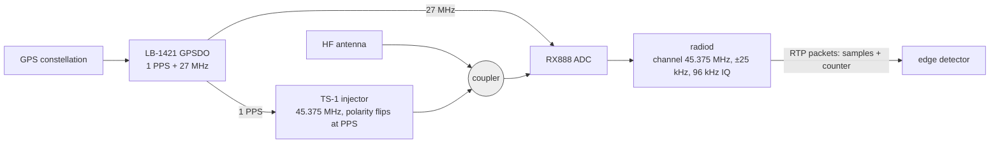
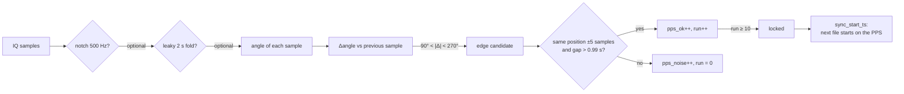
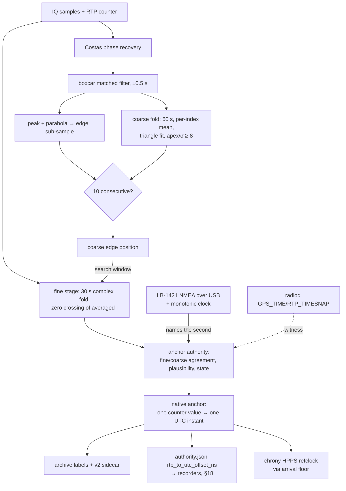

# Finding the PPS edge in a BPSK carrier: two methods, compared

**Date:** 2026-09-05
**Status:** Explainer and comparison; proposes measurements, changes no code.
**Scope:** How wd-record in ka9q-radio (Scott Newell) locates the once-per-second
polarity flip of the TS-1 pilot, how hf-timestd locates the same flip to establish
and hold T6, what each method gains and gives up, and how to measure the
difference between them.  A companion page, `T3_FUSION_EXPLAINED.md`, covers
how FUSION establishes T3.

The metrology framework that informs both: `MEASUREMENT_MODEL.md` (one
measurand, one ruler, one registration) and `TIMING_PROVENANCE_MODEL.md`
(the record a consumer reads).  This page describes methods; those pages
define what the methods measure.

---

## 1. The signal both methods look at

An LB-1421 GPS-disciplined oscillator produces 1 PPS and a 27 MHz reference.
A TS-1 injector (Paul Elliott, WB6CXC) turns that PPS into a carrier at
45.375 MHz whose polarity flips once per second, on the PPS edge.  Between
flips the carrier carries nothing.  The TS-1 couples the carrier into the
receive path ahead of the RX888, which the same 27 MHz reference disciplines.
radiod tunes a channel to 45.375 MHz, filters ±25 kHz, and emits complex
samples at 96 kHz with an RTP timestamp on every packet.

Every edge therefore arrives as a step in the phase of a clean local carrier.
No ionosphere sits in this path.  What separates the edge in the samples from
the edge at the GPS antenna amounts to cable, the injector's own delay, the
receiver front end and the channel filter's group delay, all of them fixed or
slowly varying.  `reference_ts1_pps_injection_t6` in the project memory records
the consequence: the ionosphere never enters T6, and the 16.618 ms figure in the
station configs names a constant, not a propagation term.

The RTP counter ticks once per sample at a rate the GPSDO sets.  Its origin
means nothing by itself; radiod also publishes a pair, its GPS_TIME against
RTP_TIMESNAP, which says what its host clock read when a given counter value
went by.  That pair descends from the host clock, so both methods below have
to decide how far to trust it.

---

## 2. Method N: Newell's state machine in wd-record

`wd-record.c`, `bpsk_state_machine()`.  ka9q-python ported the same algorithm
as `BpskPpsCalibrator`; hf-timestd carried that port as its first calibrator
and retired it on 2026-09-04.

**What it does, per sample.**  Take the phase angle of each complex sample.
Subtract the previous sample's angle.  When the difference lands between 90°
and 270°, call that sample an edge.  Two checks then sort real edges from
noise.  The new edge's position within the second, its counter value modulo
the sample rate, must sit within 5 samples of the previous edge's position.
The gap since the previous edge must exceed 0.99 s.  An edge that passes both
counts as ok and extends a run; one that fails counts as noise and resets the
run.  Ten consecutive ok edges make a lock.

**Two optional front ends.**  A 500 Hz biquad notch (pole radius 0.99) can
remove an interfering tone before the angle is taken.  A leaky fold can run
ahead of the detector: an accumulator two seconds long, indexed by the sample
counter modulo two seconds, holds an exponentially weighted average of every
sample that landed at that position.  Flipping polarity each second means the
two-second fold keeps the sign pattern intact.  The detector then works on the
folded, quieter sample rather than the raw one.

**What it produces.**  The counter value of the edge, and from it the position
of the PPS within the second.  wd-record uses that position for one purpose:
to compute `sync_start_ts`, the counter value at which the next recording
file should begin so that WSPR and FT8 periods start on the GPS second.  It
disciplines no clock and publishes no time.  It aligns files.

**Pros.**
- Simple enough to hold in the head, and to audit in a few minutes.
- Each edge stands on its own.  No integration window, so no carrier
  rotation inside a window can move the peak, and no state can cement a
  wrong position for long.
- No carrier recovery loop, so nothing to tune when the carrier's noise
  regime drifts.
- Cheap.  A few operations per sample, in C, inside the recorder.
- The optional fold gives real processing gain when the signal weakens,
  and it does so without a search.

**Cons.**
- A single-sample decision.  At a sample-to-sample phase noise comparable to
  90°, which the 16 kHz channels of its day produced, the detector fires on
  noise and resets on noise.  hf-timestd abandoned the port for exactly that
  reason (`BPSK-PPS-DETECTION-METHODS.md` §2).
- Resolution ends at one sample.  The angle test names a sample, not a
  sub-sample instant, so the floor sits at 10.4 µs at 96 kHz, 62.5 µs at
  16 kHz.
- The tolerance of ±5 samples and the 0.99 s gap protect the run, but they
  compare each edge to the previous accepted edge.  A slow walk that moves
  fewer than 5 samples per second passes every check.
- It names a position within the second and stops.  Which second, and how
  that second relates to UTC, come from elsewhere: the host clock, through
  `clock_gettime`, at the moment the edge appears.  The output inherits the
  host clock's error at that moment.
- The leaky fold's time constant and the accumulator's alignment to the
  counter live as tuning choices; a counter re-base after a radiod restart
  invalidates the accumulator silently.

---

## 3. Method H: hf-timestd's two stages and the anchor

hf-timestd took the same signal and asked a harder question.  Not "where in
the second does the flip sit" but "what UTC instant does sample n carry",
stated with an uncertainty, holding across restarts and through the night.
The answer grew into a chain of five parts.

### 3.1 Coarse stage: Costas recovery and a half-second matched filter

`core/bpsk_pps_calibrator_mf.py`.  A carrier-phase loop estimates the
residual carrier phase per batch by squaring the samples and halving the
angle, low-pass filtered across batches.  Rotating the samples by that
phase puts the polarity on the real axis.  A boxcar matched filter then sums
the next half-second of in-phase samples and subtracts the previous
half-second.  For a signal that flips once per second this template
maximises the output SNR; the output rises to a triangular apex of height
N·A at every flip, N being 48 000 samples.  A three-point local-maximum test
finds peaks, a parabola through the three samples around each peak gives a
sub-sample position, and the same two gates Newell used, a position tolerance
and a minimum gap, sort edges from noise.  Ten consecutive edges lock.

The coherent integration buys about 47 dB over a single-sample decision.  It
also brings its own failure modes, all of them recorded in
`BPSK-PPS-DETECTION-METHODS.md` and `HF-PPS-CHRONY-TUNING.md`: the Costas
loop's excursions gate acceptance for tens of seconds; the apex spans half a
second, so at low C/N0 the noise ripple along it moves the argmax by about
100 samples from one second to the next, more than the tolerance, and the
run never closes.  On AC0G-B4 that happened every night at 48 to 57 dB-Hz
(`reference_t6_cn0_cliff_agc`).

### 3.2 Coarse fold (added 2026-09-05)

The same module now folds its own matched-filter output.  Each second's
output, sign-alternated because the flip alternates, adds into an accumulator
indexed by the counter modulo one second, averaged per index over 60 s.
The apex grows as 60 while the noise grows as the square root of 60, a gain of
17.8 dB.  A triangle fitted at the apex and the residual around it give an
apex-over-sigma figure; above 8 the fold registers the edge with the same lock
state ten consecutive edges would grant.  Offline against the synthetic
generator the fold locks from 50 dB-Hz, where the per-edge path never locks,
down to 40 dB-Hz, with the edge inside half a sample.  Once a fold reference
exists it defines the chain delay and the tolerance reference; a single noisy
edge no longer re-bases either.

Newell's leaky fold and this one do the same thing in different places.  His
folds the samples before detection over a two-second period with an
exponential memory.  Ours folds the detector's output over a one-second
period with a hard 60 s window and a quality figure that decides whether the
fold may register anything.

### 3.3 Fine stage: coherent fold and zero crossing

`core/bpsk_edge_fine_stage.py`.  Thirty seconds of complex baseband, folded
modulo the sample rate with per-second sign alternation and indexed by stream
continuity rather than by each packet's declared counter, so the measured
±60-sample packet mislabelling averages out.  Carrier phase comes from the
folded samples away from the transition.  Within a few milliseconds of the
coarse position the stage fits a line through the central ramp of the
averaged in-phase component and reads the zero crossing to a fraction of a
sample.  A symmetric crossing makes amplitude tilt a second-order effect.
With no coarse seed the stage can find the edge itself in the folded second
(`T6_FOLDED_SELF_ACQUISITION.md`, `bpsk_fold_bootstrap.py`), and it confirms
such a self-acquired edge across three fold blocks before trusting it.

### 3.4 Naming the second, and the anchor

An edge position within the second still needs a second.  hf-timestd names it
from the LB-1421's own NMEA sentence over USB, paired with the counter through
a monotonic clock, never through the host's wall clock
(`_t6_name_second_via_nmea`; `reference_t6_sidelobe_capture_diurnal` records
the correction that fixed an earlier misunderstanding here).  The named edge
becomes the native anchor: one counter value paired with one UTC instant.
From there every sample's UTC follows by counter arithmetic at the GPSDO's
rate.  The anchor authority (`t6_anchor_authority.py`) watches the fine and
coarse stages agree, watches the edge stay plausible against its own history
(`t6_reference_resolver`, the learned per-station gate), and moves the tier
through ACQUIRING, AUTHORITATIVE, DEGRADED and WITHDRAWN.  radiod's pair,
which descends from the host clock, becomes a witness rather than the source
(`T6_ANCHOR_INVERSION_DESIGN.md`).

### 3.5 What T6 produces, and where it goes

Three sinks.  The archive writer labels every sample from the anchor, so the
recorded IQ carries UTC independent of the host clock; since 2026-09-05 the
chunk sidecar states the registration in force, its uncertainty with coverage,
and its origin (`TIMING_PROVENANCE_MODEL.md` §3.1).  The authority manager
publishes the anchor as `rtp_to_utc_offset_ns` in `authority.json`, which the
recorders read through contract §18 to start and end their WSPR and FT8 slots
on the sample the edge names.  And chrony receives HPPS, a refclock sample
that says "when the host clock read this, true time read that", built from the
anchor and an arrival-floor estimate of host time rather than from the moment
of the push (`t6_shm_pair.py`).

**Pros.**
- Sub-sample localisation: about 30 ns per edge at the coarse stage on a
  strong signal, and the fine stage's zero crossing below that.
- Processing gain where the signal weakens: 47 dB from the matched filter,
  17.8 dB more from the coarse fold, and the fine stage's 30 s fold on top.
- A named second from a local GPS receiver, paired through a monotonic clock.
  The host's wall clock touches neither the label nor the anchor.
- An uncertainty travels with every output, and a state machine says when the
  tier may be trusted and when it may not.
- The output serves three consumers at once: archive labels, slot boundaries
  for the decoders, and a chrony refclock.

**Cons.**
- Complexity.  Five cooperating parts, each with history, thresholds and
  failure modes of its own.  A newcomer needs this page.
- The Costas loop remains a source of trouble, gating acceptance during its
  excursions and re-acquiring at a different operating point after each
  restart.
- The half-second apex, which gives the filter its gain, also gives it the
  nightly ambiguity the fold now addresses.  Whether the fold holds through a
  real night remains to be shown; tonight is its first.
- Wrong-peak locks have happened (`project_b4_t6_wrong_lock_20260904`).  The
  guards that catch them, the reference gate and the cross-bench judge, add
  more state.
- Chain delay, position within the second, changes meaning every time radiod
  re-creates the channel, because the counter's origin moves.  Anything that
  compares chain delays across restarts must compare them against UTC, not
  against each other.

---

## 4. Side by side

| | Method N (wd-record) | Method H (hf-timestd) |
|---|---|---|
| Decision unit | one sample's phase step | 0.5 s matched filter; 60 s fold; 30 s fine fold |
| Resolution | one sample (10.4 µs at 96 kHz) | sub-sample; ~30 ns coarse, less at the fine stage |
| Processing gain | none, or the optional leaky fold | 47 dB + 17.8 dB + fine fold |
| Carrier recovery | none needed | Costas loop, with its excursions |
| Second naming | host clock at detection | LB-1421 NMEA via monotonic clock |
| Output | counter value; next file start | anchor with uncertainty; labels, slots, refclock |
| Failure modes | noise firing at low SNR; slow walk under ±5 samples | Costas gating; apex ambiguity at night; wrong-peak lock |
| Cost | a few ops per sample, in C | a Python service, tens of ms per batch |
| Cross-restart meaning | none (position only) | UTC anchor survives; chain delay does not |

The two methods answer different questions.  Newell's aligns recordings to
the PPS and asks nothing more of the edge.  Ours turns the edge into a
registration with a stated uncertainty and carries that registration to
three consumers.  Both find the same flip; the difference lies in what they
promise about it afterwards.

---

## 5. How to measure the difference

Every proposal below runs on data the stations already record, or on the
synthetic generator the test suite already ships.  None changes a station.

1. **Same samples, both detectors.**  `/var/lib/timestd/state/t6-anomaly/`
   holds 60 s IQ captures of the T6 channel from B4, taken at anomalies.
   Run Newell's port (`ka9q.pps_calibrator.BpskPpsCalibrator`) and ours on
   each file and tabulate, per capture, the edge position each reports, the
   number of edges each accepts and rejects, and whether each locks.  The
   captures cluster in the small hours, so they sample the regime where the
   methods should differ most.
2. **Synthetic cliff, both detectors.**  `tests/test_bpsk_pps_calibrator_mf._make_bpsk_signal`
   generates a band-limited flip at a chosen C/N0.  Sweep 75 down to 35 dB-Hz
   at two seeds per point, 130 s each, and record for each detector the first
   lock time, the edge error in samples, and the lock fraction.  This gives
   the lock cliff of each method as a curve, not an anecdote.  Note the
   caveat already recorded: the generator's noise spans the full 96 kHz while
   the station's noise sits within ±25 kHz, so the real cliffs sit a few dB
   higher.
3. **Against T5, on the station.**  The authority history store records T5's
   offset every tick beside T6's anchor.  Over a night, compute the RMS of the
   T6 anchor against T5's GPS PPS per hour.  Then re-run Newell's port on the
   archived T6-channel IQ (a proposal in itself, since that channel has no
   archive today; §7) and compute the same RMS.  This is the comparison that
   answers "which method gives the better registration", and it is the same
   comparison the overclaim gate already performs for T6 alone.
4. **Slot alignment, end to end.**  Both methods exist to put the start of a
   WSPR or FT8 period on the GPS second.  Measure it directly: decode the
   same period from a recording cut by wd-record's `sync_start_ts` and from
   one cut by a recorder that reads `rtp_to_utc_offset_ns`, and compare the
   decoded `dt` of strong stations.  wsprd and jt9 report `dt` for every
   decode; its distribution across a night measures the alignment error of
   each method in the units the science uses.
5. **Restart behaviour.**  Restart each detector ten times against the same
   signal and record the spread of the position each reports.  Newell's
   method has no state to lose; ours has a Costas operating point and a
   reference gate.  The spread quantifies the "per-restart drift" the
   methods record complains of.

Pre-register the analysis for 3 and 4 before looking at the data, as the
parking A/B was: the hours to compare, the statistic, and what result would
count against each method.

---

## 6. What this changes about T6, and what it does not

Nothing here changes the metrology.  The measurand stays the UTC instant of
sample n at the antenna terminals; the ruler stays the GPSDO; the
registration stays the anchor.  What the comparison offers is a second,
independent estimator of the same edge, cheap enough to run beside ours as a
witness.  If Newell's per-sample detector agrees with our fine stage within a
sample on a strong signal, the agreement is worth recording in the chain's
budget as a Type A check of the edge-estimation term, the term that today
carries a 5 µs bound because the fine-stage sweep has not run.  If they
disagree, the disagreement names something one of them misunderstands about
the signal, and that is worth more than agreement.

## 7. Open questions this raises

- The T6 channel has no archive, so proposals 1 and 3 can only use the
  anomaly captures unless the channel gains one.  A 96 kHz complex stream
  costs 768 kB/s; a night is 27 GB.  A rolling day would be enough for these
  studies.
- Newell's leaky fold runs before detection at the sample level; ours runs
  after the matched filter.  A fold of the raw samples followed by our
  matched filter would combine the gains.  Whether that helps beyond what the
  fine stage already does deserves a measurement, not a guess.
- The "position within the second" that both methods report should perhaps be
  retired as a diagnostic figure in favour of the anchor's residual against
  T5, which survives restarts and means the same thing on every station.
